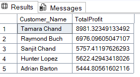
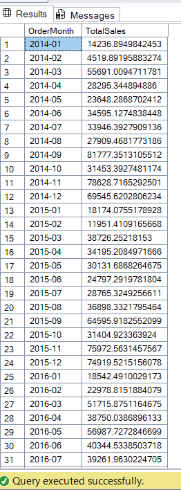
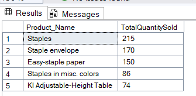
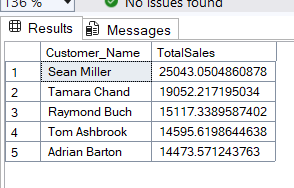
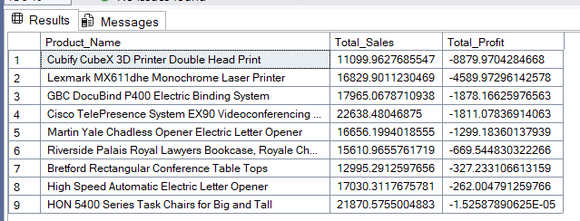
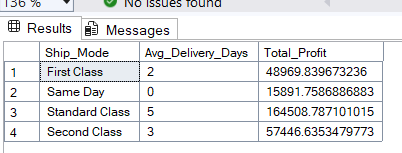
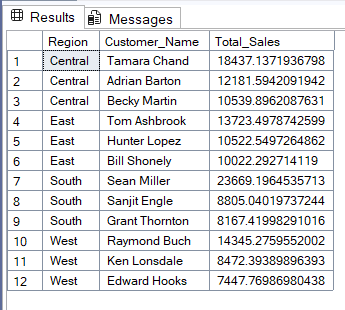
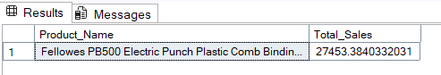

# 📊 Superstore SQL Analysis 

## 📌 Project Overview 
This project analyzes the **Superstore Dataset** using **SQL Server**. 
The aim is to derive meaningful business insights with **advanced SQL queries** such as: 
- Total Sales & Profit trends 
- Top & second-highest performing products 
- Customer purchase behavior 
- Shipping performance 

---

## 🗂 Dataset 
Dataset Source: [Superstore Dataset (Kaggle)](https://www.kaggle.com/datasets/vivek468/superstore-dataset-final) 

---

## 🔑 Key SQL Concepts Used 
- **CTEs & Subqueries** – reusable query blocks 
- **Window Functions** – RANK, ROW_NUMBER, NTILE, LAG
- **Aggregations** – SUM, COUNT, AVG, GROUP BY 
- **Joins** – combining multiple tables 
- **Filtering & Sorting** – advanced WHERE + ORDER BY 

---

## 📂 Files 
- [Analysis.sql](Analysis.sql) → All queries used for analysis 

---

## 📷 Query Outputs 

**1️⃣ Total Sales & Profit by Category**  

**2️⃣ Top 5 Profitable Customers**  

**3️⃣ Monthly Sales Trend**  

**4️⃣ Profit by Region**  

**5️⃣ Top 5 Products by Quantity Sold**  

**6️⃣ Top 5 Customers by Total Sales**  

**7️⃣ Monthly Sales Trend**  

**8️⃣ Year-over-Year (YoY) Growth in Sales**  

**9️⃣ Top 5 Customers by Total Profit**  

**🔟 Loss-Making Products**  

**1️⃣1️⃣ Regional Performance with Ranking**  

**1️⃣2️⃣  Customer Segmentation**  

**1️⃣3️⃣  Shipping Speed Impact on Profit**   

**1️⃣4️⃣  Top 3 Customers in Each Region**  

**1️⃣5️⃣  Second Highest Sales per Region**  

**1️⃣6️⃣ Second Highest Product By Sales**  

---

## 🛠️ Tech Stack 
- SQL Server 2019 
- Superstore Dataset 
- GitHub for version control 

---


## 🚀 How to Use
1. Clone this repository
    ```bash
    git clone [https://github.com/your-username/Superstore-SQL-Analysis.git](https://github.com/your-username/Superstore-SQL-Analysis.git)
    ```
2. Import the Superstore Dataset into a SQL Server database.
3. Run the queries from the `Analysis.sql` file to reproduce the results.
