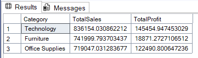
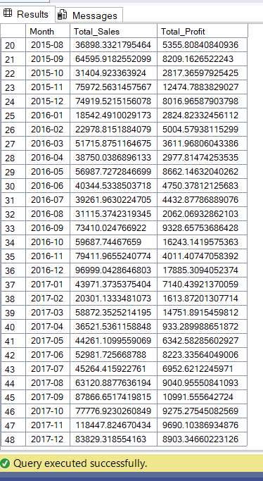
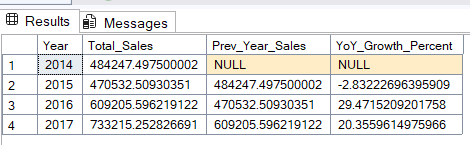
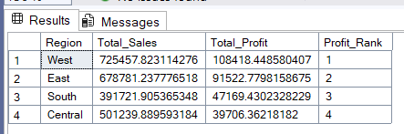
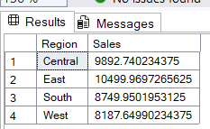

# 📊 Superstore SQL Analysis 

## 📌 Project Overview 
This project analyzes the **Superstore Dataset** using **SQL Server**. 
The aim is to derive meaningful business insights with **advanced SQL queries** such as: 
- Total Sales & Profit trends 
- Top & second-highest performing products 
- Customer purchase behavior 
- Shipping performance 

---

## 🗂 Dataset 
Dataset Source: [Superstore Dataset (Kaggle)](https://www.kaggle.com/datasets/vivek468/superstore-dataset-final) 

---

## 🔑 Key SQL Concepts Used 
- **CTEs & Subqueries** – reusable query blocks 
- **Window Functions** – RANK, ROW_NUMBER, NTILE, LAG
- **Aggregations** – SUM, COUNT, AVG, GROUP BY 
- **Joins** – combining multiple tables 
- **Filtering & Sorting** – advanced WHERE + ORDER BY 

---

## 📂 Files 
- [Analysis.sql](Analysis.sql) → All queries used for analysis 

---

## 📷 Query Outputs 

### Sales & Profit Analysis

**1️⃣ Total Sales & Profit by Category**  

**2️⃣ Top 5 Profitable Products**  

**3️⃣ Second Highest Product by Total Sales**  

**4️⃣ Monthly Sales Trend**  

**5️⃣ Monthly Sales & Profit Trend**  

**6️⃣ Year-over-Year (YoY) Growth in Sales**  

---

### Customer & Regional Insights

**7️⃣ Top 5 Customers by Total Sales**  

**8️⃣ Top 5 Customers by Total Profit**  

**9️⃣ Customer Segmentation** ..png) 

**🔟 Top 3 Customers in Each Region**  

**1️⃣1️⃣ Regional Performance with Ranking**  

**1️⃣2️⃣ Second Highest Sales per Region**  

---

### Product & Shipping Performance

**1️⃣3️⃣ Top 5 Products by Quantity Sold**  

**1️⃣4️⃣ Loss-Making Products** ..png) 

**1️⃣5️⃣ Shipping Speed Impact on Profit**  

---

## 🛠️ Tech Stack 
- SQL Server 2019 
- Superstore Dataset 
- GitHub for version control 

---

## 🚀 How to Use 
1. Clone this repository 
   ```bash
   git clone [https://github.com/your-username/Superstore-SQL-Analysis.git](https://github.com/your-username/Superstore-SQL-Analysis.git)
